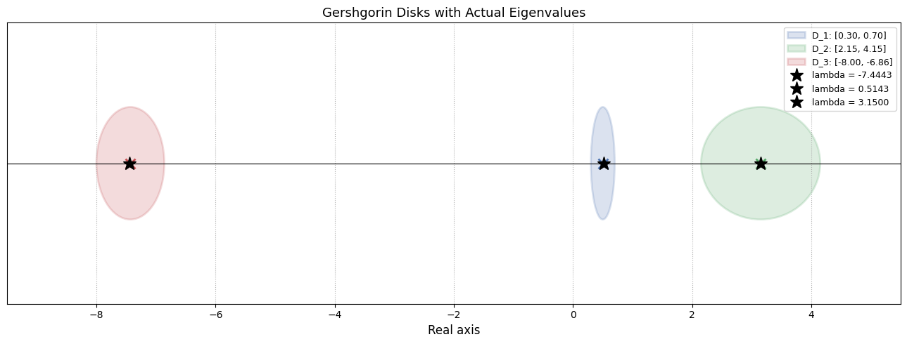

# Iterative Linear System Solvers & Spectral Analysis

## 📖 Description
A Python-based project implementing iterative numerical methods to solve systems of linear equations ($Ax = b$). This project provides a comparative analysis of convergence behaviors and spectral properties of various matrix systems.

## 🧮 Algorithms Implemented
* **Jacobi Method:** Iterative solver for strictly diagonally dominant systems.
* **Gauss-Seidel Method:** Efficient solver using updated vector components immediately.
* **Successive Over-Relaxation (SOR):** Accelerated convergence using a relaxation factor ($\omega$).

## 📊 Spectral Analysis & Gershgorin Circle Theorem
To assess stability, the project performs spectral analysis using the **Gershgorin Circle Theorem**.
* **Eigenvalue Bounds:** Visualized complex plane disks to estimate eigenvalue bounds.
* **Stability Assessment:** Evaluated the relationship between matrix spectral radius and convergence efficiency.

## 🛠 Tech Stack
* **Language:** Python
* **Libraries:** `NumPy` (computation), `Matplotlib` (visualization).

## 💻 How to Run
1. Clone the repository.
2. Open `Ansh_Verma_2406303.ipynb` in your preferred environment.
3. Run the cells to observe real-time convergence plots and spectral visualizations.# Numerical-analysis
